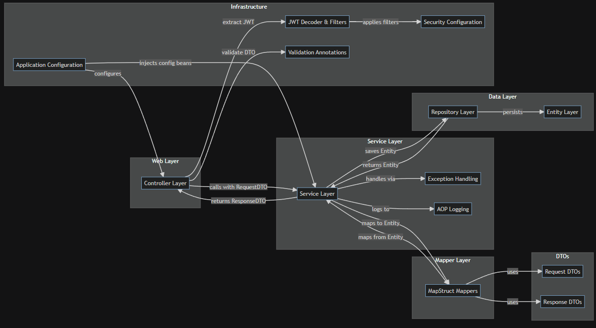
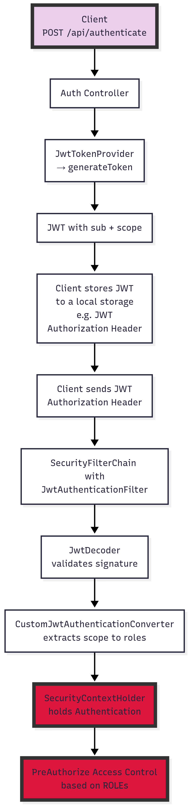

# 📘 Spring Boot Backend – Mavrommatis eBookshop Documentation

A comprehensive backend documentation for the **Mavrommatis eBookshop** system.

Here you'll find information about the architecture, security, services, entities, and flow of the application.

---

## 🏗️ Architecture Overview

### Purpose & Scope

This document provides a complete overview of the backend architecture of the eBookshop system, built using **Spring Boot**.

It outlines the **layered design**, **security flow**, **validation strategy**, and **data model**, with the goal of delivering:

- Maintainability
- Scalability
- Clarity

---

## 📁 Module Structure

### 🔼 LAYERING (Top to Bottom)

#### 📂 `controller`
- **api.basic** → Handles CRUD and standard endpoints for `Book`, `Author`, `Customer`, etc.
- **api.details** → Provides enriched views (e.g., `BookDetails`, `AuthorDetails`).
- **system** → Technical endpoints like auth, login, health-check.

#### 🧠 `service`
- **basic** → Core business logic for base entities.
- **details** → Business logic for enriched/profile data.

#### 📦 `dto`
- **request** → DTOs received via HTTP (POST/PUT). Include validation annotations.
- **response** → DTOs returned to clients. Hide internal data; expose essentials.
- **details** → Nested/enriched DTOs (e.g., `AuthorDetailsDTO`).

#### 🔁 `mapper`
- Uses **MapStruct** to convert between DTOs and Entities bidirectionally.

#### 🧱 `entity`
- **basic** → Core domain entities (`Book`, `Author`, `Customer`) – map directly to database tables.
- **details** → One-to-one enrichments (e.g., `BookDetails`, `CustomerDetails`) for detailed views.
- **helper** → Join entities like `AuthorBookEntity` to represent many-to-many relationships.

#### 💽 `repository`
- **basic** → JPA Repositories for base entities. Extend `JpaRepository<T, ID>`.
- **details** → Repositories for enrichment entities (e.g., `BookDetailsRepository`).

---

## ✂️ Cross-Cutting Concerns

### ✅ `validator`
- **annotation** → Defines custom annotations (e.g., `@ValidISBN`, `@ValidPhone`) for field-level constraints.
- **validation** → Implements the logic behind each annotation using `ConstraintValidator`.

### ❌ `exception`
- **author** → Exceptions for missing authors or author detail mismatches.
- **book** → Book/domain-related exceptions for missing data or unauthorized access.
- **customer** → Customer identity, profile, and access violation exceptions.
- **review** → Review-specific exceptions (e.g., ownership, duplicate prevention).

### 📝 `logging` & `aop`
- **RequestLoggingFilter** → Logs incoming HTTP request metadata (headers, query params, body).
- **LoggingAspect** → Captures internal method calls, parameters, duration, and exceptions.
- Together, they provide **end-to-end observability**.

### 🔐 `security`
- **config** → Configures HTTP security, endpoint rules, JWT filter chain, and in-memory users.
- **converter** → Converts JWT claims into Spring Security roles (e.g., from `scope` claim).
- **jwt** → Generates signed JWTs with roles and expiration metadata after authentication.
- **util** → Utility methods like `getCurrentUsername()` and `hasRole()` to assist in role-based logic.

---

## 🚧 Future Enhancements (optional section you can add)
- ✅ Swagger/OpenAPI integration
- ✅ Role-based field hiding in DTOs (already implemented)
- 🔲 Unit & integration tests (WIP)
- 🔲 Spring MVC + Thymeleaf frontend (optional)

---

## ✍️ Author

> Developed with ☕ by Spiros Mavrommatis.  
> For questions, feel free to open an issue or start a discussion.

---

## 🧩 Layer-by-Layer Summary

| **Layer**     | **Responsibility**                          | **Technologies**                                           |
|---------------|---------------------------------------------|------------------------------------------------------------|
| Controller    | REST endpoints, validation, delegation       | Spring MVC, `@RestController`                             |
| Service       | Business logic, security, exceptions         | Spring, Custom Exceptions, `@Transactional`               |
| Mapper        | DTO → Entity mapping                         | MapStruct, `@Mapper`                                      |
| Repository    | Persistence abstraction                      | Spring Data JPA                                            |
| Entity        | Domain models                                | JPA, Lombok                                                |
| Validation    | Input constraints                            | Custom annotations, Hibernate Validator                    |
| Security      | Auth, access control                         | Spring Security, JWT, `@PreAuthorize`                     |
| AOP           | Logging                                      | `@Aspect`, SLF4J, `@Around`                               |

---

🔧 High-Level Architecture

---

## 🧱 Modular Architecture Description

The system follows a **modular, layered architecture** that promotes separation of concerns, scalability, and testability.

### 🧩 Web Layer
- Handles incoming **HTTP requests**
- Applies **security annotations** (e.g., `@PreAuthorize`)
- Delegates execution to the **Service layer**

### 🔧 Service Layer
- Implements **core business logic**
- Enforces **ownership rules** and **role-based access**
- Handles custom exceptions and security boundaries

### 🔁 Mapper Layer
- Responsible for converting between **DTOs and Entities**
- Uses **MapStruct** for type-safe, boilerplate-free mapping

### 💽 Repository Layer
- Contains **JPA interfaces** for database access
- Abstracts away data persistence and enables query methods

### 🧬 Entity Layer
- Includes domain models annotated with **JPA**
- Represents the application's **persistent data structures**

### 🧰 Infrastructure
- Houses **Security configurations**, JWT filters, and role extractors
- Defines **custom validation logic** through annotations and validators
- Provides **AOP logging** for observability
- Implements **global exception handling** for consistent API error responses

---

## 🔧 Security Model Flow(JWT-Based)

  

| **Step** | **Description**                                                             | **Class/Location**                                               |
|----------|------------------------------------------------------------------------------|------------------------------------------------------------------|
| 1        | Client logs in via `/api/authenticate`                                       | `AuthRestController` (`controller/system`)                       |
| 2        | Token is generated with `sub + scope`                                        | `JwtTokenProvider.java` (`security`)                             |
| 3        | JWT returned to client                                                       | –                                                                |
| 4        | Client sends token via `Authorization` header                                | –                                                                |
| 5        | Token filtered/validated by Spring Security                                  | `ApiSecurityConfig.java → SecurityFilterChain`                  |
| 6        | Signature validated                                                           | `JwtDecoder` via `JwtConfig.java`                                |
| 7        | Roles extracted from `scope`                                                 | `CustomJwtAuthenticationConverter.java`                          |
| 8        | Authentication saved                                                         | `SecurityContextHolder` (Spring Security)                        |
| 9        | Access enforced via annotations                                              | `@PreAuthorize` on Controller/Service methods                    |

---

## 🧩 Entity Relationship Design

| **Entities**                  | **Relationship** | **Type**       | **Directionality** |
|------------------------------|------------------|----------------|---------------------|
| `Book` – `BookDetails`       | One-to-One       | Enrichment     | Bidirectional       |
| `Author` – `AuthorDetails`   | One-to-One       | Metadata       | Bidirectional       |
| `Author` – `Book`            | Many-to-Many     | Core Link      | Bidirectional       |
| `Customer` – `BookReviews`   | One-to-Many      | Reviews        | Bidirectional       |
| `Customer` – `CustomerDetails`| One-to-One      | Profile Info   | Bidirectional       |

> ### 📘 Glossary of Relationship Types

- **Enrichment**: Adds functional or descriptive content to a primary entity.  
  _Example_: `BookDetails` adds page count, dimensions, and weight to a `Book`.

- **Metadata**: Provides biographical or informational data associated with a core entity.  
  _Example_: `AuthorDetails` includes birth date, bio, and website.

- **Core Link**: A fundamental business relationship implemented through a join entity.  
  _Example_: The `Author` ↔ `Book` association is maintained via `AuthorBookEntity`.

- **Reviews**: Represents user-generated content linked to a subject entity.  
  _Example_: Each `Customer` can create multiple `BookReviews`.

- **Profile Info**: Stores extended user-specific attributes in a 1:1 manner.  
  _Example_: `CustomerDetails` extends the `Customer` with address, phone, and full name.
